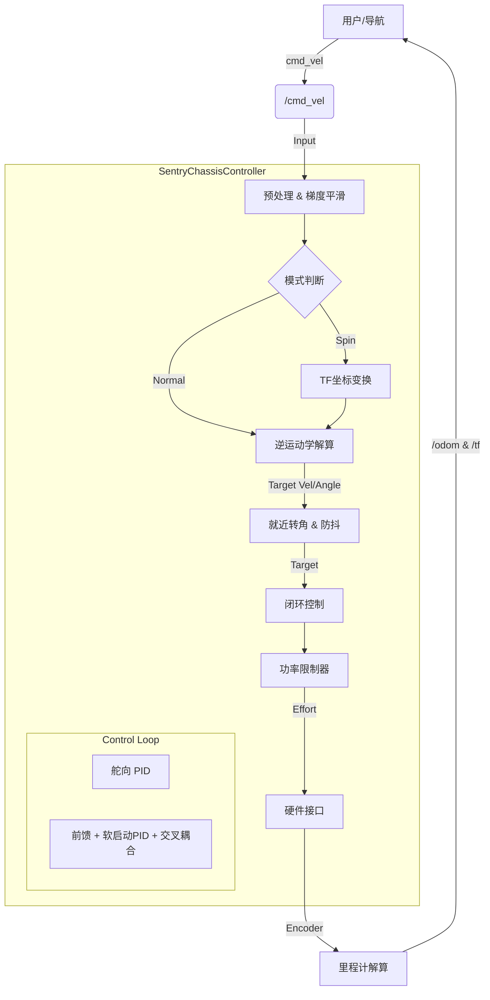

# Sentry Chassis Controller（哨兵底盘控制器）

工作空间级安装、构建和启动说明见 [`dx_final/README.md`](../../../README.md)；本文件聚焦控制器实现和数据流。

## 项目简介

本项目是为 **RoboMaster 哨兵机器人 (Sentry Robot)** 开发的高性能全向底盘控制器插件。基于 `ros_control` 框架开发，采用 **四舵轮 (Swerve Drive)** 

**开发者**: DynamicX  - 黄智斌
**适用机器人**: 4 舵轮哨兵底盘 (Swerve Drive)

---

## 核心

### 1. 运动控制
* **前馈+PID复合控制**: 采用静摩擦力补偿与 KV 前馈，配合 **"软启动"策略**（起步阶段屏蔽 PID 积分项），彻底消除了电机死区导致的起步暴冲。
* **交叉耦合控制 (Cross-Coupling)**: 引入多轴同步算法，实时协调四轮转速，有效抑制因地面摩擦不均导致的**轨迹跑偏**现象。
* **就近转角优化**: 自动计算舵机最短路径，当目标角度误差 > 90° 时自动反转轮速，大幅提升动态响应速度。

### 2.
* **普通模式**: 也就是底盘云台分离模式，支持全向移动。
* **小陀螺模式 (Spin)**: 支持边自旋边平移。集成 TF2 坐标变换，实现**世界坐标系 (World Frame)** 控制。
* **驻车锁死 (Stop)**: 停车时将舵轮锁定为 "X" 型或 "O" 型，利用物理摩擦力防止被推走。

### 3. 
* **功率控制**: 内置虚拟电容与功率模型，实时预测电机功耗。当能量不足时，动态通过 `k_scale` 缩放全车力矩，严格遵守 50W/120W 功率限制规则。

### 4.
* **未对齐保护**: 当舵角误差较大时，自动切断驱动动力，防止机器人"未对齐先乱跑"。
* **死区防抖**: 针对微小指令进行死区过滤，防止舵机在零位反复抽搐。

---

## 架构

控制器作为一个 `controller_interface` 插件运行在 ROS Control 循环中 (1kHz)。

### 控制数据流

