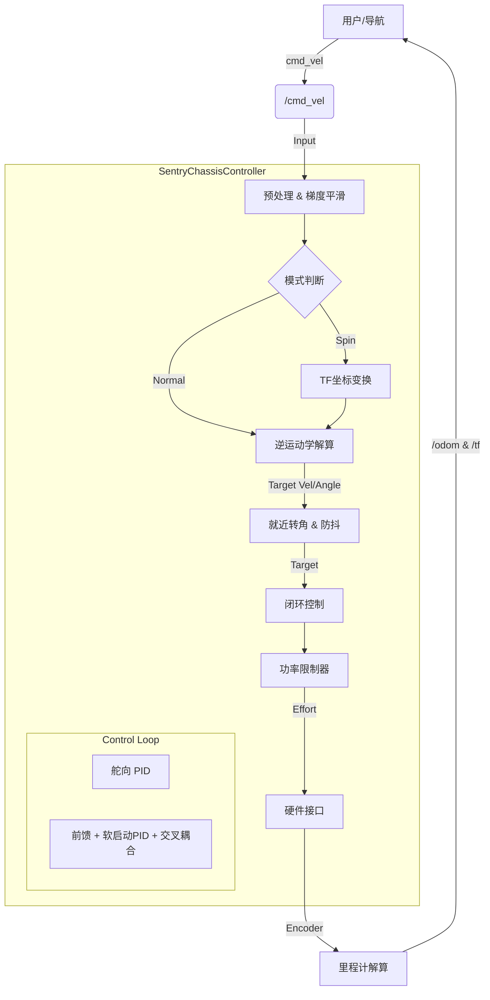

# Sentry Chassis Controller(舵轮底盘控制器)

为 RoboMaster 机器人底盘(仿真模型名 `sentry`)开发的**四舵轮 (Swerve Drive) 全向底盘控制器**,以 `ros_control` 插件形式运行在 1kHz 控制循环中。集成逆运动学、8 个 PID、前馈 + 软启动、交叉耦合、虚拟电容功率限制、里程计与 tf。

> 关于命名:包名 `sentry_chassis_controller` 沿用 Gazebo 仿真里的机器人模型名 `sentry`(来自 `rm_description`);本工作区的主题是**四舵轮底盘控制器**,两者指同一个项目。

工作区级安装、构建、启动说明见 [dx_final/README.md](../../README.md);本文件聚焦**控制器实现与数据流**,是读代码的向导。

## 运行与键盘操作

```bash
roslaunch sentry_chassis_controller sentry_chassis_control.launch gui:=true keyboard:=true
```

| 按键 | 功能 |
| --- | --- |
| `W` / `S` | 前进 / 后退(每次 ±0.5 m/s) |
| `A` / `D` | 左移 / 右移(每次 ±0.5 m/s) |
| `Q` / `E` | 逆时针 / 顺时针旋转(每次 ±0.5 rad/s) |
| `SPACE` | 急停(清零) |
| `G` | 小陀螺模式 ↔ 普通模式 |
| `H` | 世界坐标系控制 ↔ 车体坐标系控制 |
| `ESC` | 退出键盘节点 |

## 架构

控制器作为 `controller_interface::Controller<EffortJointInterface>` 插件,由 `controller_manager` 加载(pluginlib 机制),`update()` 每 1ms 执行一次。

### 控制数据流



### update() 主循环流程(读代码入口)

1. **对齐检查**:四轮舵角误差全部 < 阈值(静止 0.05rad / 运动中 0.1rad)才算 `all_wheels_aligned`;
2. **指令平滑**(`rampVelocity`):仅在对齐或停车时更新,防止未对齐时速度突变;
3. **模式切换**:指令与平滑速度均为 0 → 停止模式;否则普通/小陀螺模式;小陀螺模式下 `angular.z` 被固定为 `spin_vw`;
4. **逆运动学**(`calculateWheelStates`):把车体速度解算为四轮目标舵角与目标轮速,含就近转角与防抖;
5. **PID 闭环**:每轮一个舵向位置 PID + 驱动速度 PID(前馈 + 软启动 + 交叉耦合 + 限幅);
6. **功率限制**(`limitPower`):超限时按 `k_scale` 等比例缩放四轮力矩;
7. **里程计**(`calculateOdom`):正运动学解算车体速度,积分位姿,发布 `/odom` 与 `odom→base_link` TF;
8. **调试发布**:每轮 target/actual/effort 三个 Float64 话题。

## 话题与 TF

| 方向 | 名称 | 类型 | 说明 |
| --- | --- | --- | --- |
| 订阅 | `/cmd_vel` | `geometry_msgs/Twist` | 速度指令;`use_world_frame=true` 时视为 `odom` 系 |
| 订阅 | `/keyboard/key` | `std_msgs/String` | 模式切换按键(`g`/`h`) |
| 发布 | `/odom` | `nav_msgs/Odometry` | 里程计(frame: odom → base_link) |
| 发布 | `/debug/{lf,rf,lb,rb}_wheel/target` | `std_msgs/Float64` | 各轮**目标**转速(rad/s) |
| 发布 | `/debug/{lf,rf,lb,rb}_wheel/actual` | `std_msgs/Float64` | 各轮**实际**转速(rad/s) |
| 发布 | `/debug/{lf,rf,lb,rb}_wheel/effort` | `std_msgs/Float64` | 各轮**输出力矩**(Nm,功率限制后) |
| TF 广播 | `odom → base_link` | — | 里程计位姿 |
| TF 监听 | `odom → base_link` | — | 世界坐标系控制时做速度变换 |

> 轮序约定:0=左前 lf,1=右前 rf,2=左后 lb,3=右后 rb。

## 参数

### 参数服务器(`config/chassis_params.yaml`,命名空间 `/sentry_chassis_controller/sentry_chassis_plugin`)

| 参数 | 默认 | 说明 |
| --- | --- | --- |
| `*_steer_p/i/d` | 8.0 / 0.1 / 0.1 | 四个舵向电机 PID(位置环,输出力矩) |
| `*_wheel_p/i/d` | 1.0 / 0.2 / 0.0 | 四个驱动电机 PID(速度环) |
| `*_wheel_max` | 1.5 | 对应驱动轮输出力矩限幅(Nm) |
| `wheel_track` / `wheel_base` | 0.362 / 0.362 | 轮距 / 轴距(m),参与逆运动学与里程计 |
| `offset_*` | 0.0 | 四个舵机安装零偏(rad),Gazebo 中应为 0 |
| `spin_vw` | 10.0 | 小陀螺模式固定自转角速度(rad/s) |
| `use_world_frame` | false | 是否把 `/cmd_vel` 解释为世界系(odom)速度 |
| `acc_linear` | 0.08 | 线加速度限制(m/s²) |
| `acc_angular` | 0.8 | 角加速度限制(rad/s²) |
| `sync_kp` | 5.0 | 交叉耦合(轮速同步)增益 |
| `kv_spin` | 0.13 | 旋转时侧向摩擦力前馈补偿 |
| `odom_linear_scale` | 1.000 | 里程计线速度校准系数 |
| `odom_angular_scale` | 1.004 | 里程计角速度校准系数 |
| `power_constant_loss` | 10.0 | 底盘静态功率损耗(W) |
| `power_max_input` | 50.0 | 电容最大输入功率(W) |
| `stop_mode_kp` | 10.0 | 驻车制动力矩系数(Nm/(rad/s)) |
| `stop_mode_max_force` | 3.0 | 驻车最大制动力矩(Nm) |

### dynamic_reconfigure(`cfg/ChassisOps.cfg`)

以上 PID 与运动学参数大多**同时注册了动态调参**,运行时用 `rqt_reconfigure` 修改即时生效;默认值与 `chassis_params.yaml` 不同时以 YAML 启动值为准(加载顺序:先 YAML 后回调)。调好后记得抄回 YAML。

### 硬编码常量(`sentry_chassis_controller.cpp` 顶部)

| 常量 | 值 | 说明 |
| --- | --- | --- |
| `WHEEL_PERIMETER_` | 0.3456 m | 轮周长(半径约 5.5cm),用于轮速 m/s ↔ rad/s 换算 |
| `CONSTANT_POWER_LOSS` | 10 W | 静态损耗(与 YAML 参数重复) |
| `MAX_INPUT_POWER` | 50 W | 电容输入功率 |
| `kv_linear` | 0.039 | 平移前馈系数(实测经验值) |
| `static_friction` | 0.05 Nm | 静摩擦力矩补偿(死区消除) |

## 核心算法导读

### 1. 逆运动学(`calculateWheelStates`)

把车体速度 `(vx, vy, ω)` 解算为四轮目标舵角与轮速。设 `a = 轮距/2`,`b = 轴距/2`:

- **纯平移**:四轮舵角同向 `θ = atan2(vy, vx)`,轮速相同;
- **纯旋转**:四轮舵角指向旋转中心 `atan2(±b, ±a)`,轮速 = `|ω| · radius`,`radius = √(a² + b²)`;
- **混合运动**(通用公式,以左前轮为例):
  ```cpp
  A = vx - ω·a;  D = vy + ω·b;
  angle = atan2(D, A);
  speed = sqrt(A² + D²);
  ```
  其余三轮按 `(±a, ±b)` 符号组合展开(源码注释中一一对应)。

### 2. 就近转角优化与防抖

- 角度差归一化到 `[-π, π]`;若 |diff| > 90°,舵角转 180° 且**轮速取反**——舵机走短路径,响应更快;
- |diff| < 0.01rad 视为锁定,不更新目标角,防止舵机零位抽搐;
- 目标轮速 < 0.001 时保持当前舵角。

### 3. 软启动 + 前馈(驱动轮)

- **起步阶段**(|目标| < 0.2 rad/s 且 |实际| < 0.2 rad/s):**屏蔽 PID 积分**只靠前馈推,消除电机死区导致的起步暴冲;
- 前馈 = 静摩擦补偿(符号跟随目标)+ `kv_linear·target`(平移)+ `kv_spin·target`(旋转);
- 舵向未对齐时,目标轮速按 `cos(舵角误差)` 缩放——「未对齐先别乱跑」保护。

### 4. 交叉耦合(轮速同步)

纯平移时计算四轮平均实际转速,单轮相对平均值的偏差 × `sync_kp` 作为补偿力矩,抑制因地面摩擦不均导致的跑偏。

### 5. 功率限制(虚拟电容)

```text
预测功率 = Σ|轮速 × 力矩| + 静态损耗
电容能量 += (输入功率50W - 预测功率) × dt,  限制在 [0, 60] J
能量 > 20J → 允许峰值 120W;否则 50W
超限时:k_scale = 限值/预测功率,等比例缩放四轮力矩
```

模拟机器人电容的「攒能量 → 爆发 → 回充」规则,是考核「功率控制」加分项的实现。

### 6. 里程计(正运动学,`calculateOdom`)

1. 各轮线速度 `v_i = 轮速 × 轮半径`,按实际舵角分解到车体系:`(v_xi, v_yi) = v_i·(cosα, sinα)`;
2. 车体速度 = 四轮分解结果**平均**;角速度由 `(x·v_y − y·v_x)/r²` 叠加后平均;
3. 乘校准系数 → 积分偏航角 → 积分位置;
4. 发布 `/odom` 并广播 `odom → base_link` TF。

> 代码注释指出「应加权而非平均」——四轮速度取平均在舵角不一致时存在模型误差,这是可优化点。

### 7. 圈数记录(`calculateRoundCnt` / `calculateTargetRoundCnt`)

舵机是无限旋转关节,`getPosition()` 会越过 ±π 跳变;通过检测相邻两帧角度差 > 180° 来维护圈数计数器,处理多圈旋转问题。

## 模式说明

| 模式 | 枚举 | 行为 |
| --- | --- | --- |
| 普通(底盘-云台分离) | `CHASSIS_SEPARATE_GIMBAL` | 全向移动,`/cmd_vel` 按设定坐标系解释 |
| 小陀螺 | `CHASSIS_SPIN` | 角速度固定 `spin_vw`,可同时平移(`g` 键切换) |
| 驻车锁死 | `CHASSIS_STOP` | 舵角摆成 X 型(±135°/±45°),有速度时施加反向制动力矩 |
| 测试/松弛 | `CHASSIS_TEST` / `CHASSIS_RELAX` | 枚举保留,当前未实现 |

## 调参指南

1. `tools:=true` 拉起 rqt_reconfigure / rqt_plot / PlotJuggler;
2. **舵向环**:先只发旋转指令,调 `*_steer_p` 到不振荡且到位快,一般 8~12;
3. **驱动环**:直线指令观察 `/debug/*_wheel/target` 与 `actual` 跟踪;稳态误差大→加 I;振荡→减 P 加 D;
4. **加速度**:`acc_linear` 过小表现为迟钝,过大则起步冲;
5. **跑偏**:优先检查 `offset_*` 与 `wheel_direction`,再用 `sync_kp` 微调;
6. 全程配合 `rosbag record` 录制,离线用 PlotJuggler 分析。

## 与考核要求的对应

| 考核项 | 实现位置 |
| --- | --- |
| PID 控制轮速(8 个 PID) | `pivot_pid_`/`wheel_pid_` + 动态调参 |
| 逆运动学 | `calculateWheelStates` |
| 正运动学里程计 | `calculateOdom` |
| tf 世界坐标速度控制 | `transformVelocity` + `use_world_frame` |
| 键盘操控 / 加速度配置 / 小陀螺 / 功率控制 / 自锁 | `keyboard_teleop` / `rampVelocity` / `ChassisSpinMode` / `limitPower` / `ChassisStopMode` |

考核原始需求见 [docs/requirements.md](../../../docs/requirements.md)。

## 目录

```
sentry_chassis_controller/
├── cfg/ChassisOps.cfg                     # dynamic_reconfigure 参数定义
├── config/
│   ├── chassis_params.yaml                # 控制器运行参数
│   └── controllers.yaml                   # controller_manager 加载配置
├── include/sentry_chassis_controller/     # 头文件(类声明)
├── launch/sentry_chassis_control.launch   # 总启动
├── sentry_chassis_controller_plugin.xml   # pluginlib 插件注册
└── src/
    ├── sentry_chassis_controller.cpp      # 控制器实现(约 800 行)
    └── keyboard_teleop.cpp                # 键盘遥控节点
```

历史实验代码(不参与构建)见 `dx_final/legacy/sentry_chassis_controller/`。
