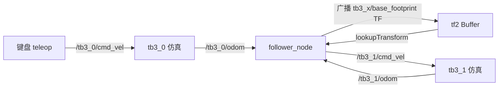

# xp_second_pkg · TurtleBot3 多机跟随(任务 2)

第二个练习包:两台 TurtleBot3 的**领航-跟随**演示。`tb3_0` 由键盘遥控,`tb3_1` 通过 tf2 获取相对位姿并自动跟随,还会记录领航车的转弯点并「抄近路」先行到达。

## 任务目标(原始要求)

1. 掌握命名空间下多机器人仿真(namespace + tf_prefix);
2. 使用 tf2 查询两个机器人之间的相对位姿;
3. 实现一个简单的跟随控制器(比例控制 + 状态机)。

## 运行

```bash
export TURTLEBOT3_MODEL=burger          # 可选 burger / waffle / waffle_pi
roslaunch xp_second_pkg multi_turtlebot3.launch
```

- 弹出的 xterm 终端里用键盘控制领航车 `tb3_0`(WASD);
- `tb3_1` 由 `follower_node` 自动控制;
- 没有 xterm 时,在另一终端手动启动领航车遥控:

```bash
rosrun turtlebot3_teleop turtlebot3_teleop_key
```

## launch 参数

| 参数 | 默认 | 说明 |
| --- | --- | --- |
| `gui` | `true` | Gazebo GUI 开关 |
| `model` | `$TURTLEBOT3_MODEL` | 车型,务必先 export 环境变量 |
| `first_tb3` / `second_tb3` | `tb3_0` / `tb3_1` | 两台车的命名空间 |
| `first_tb3_x/y/z_pos`、`first_tb3_yaw` | -2.0 / 0.0 / 0.0 / 1.57 | 领航车初始位姿 |
| `second_tb3_*` | -2.0 / -0.5 / 0.0 / 1.57 | 跟随车初始位姿 |
| `target_distance` | 0.8 | 期望跟随距离(m,参数服务器) |

## 数据流



关键点:两车里程计话题都在各自命名空间下(`/tb3_0/odom`、`/tb3_1/odom`),`follower_node` 把两个里程计位姿**广播成 `world` 下的 TF**,从而可以用一次 `lookupTransform("tb3_1/base_footprint", "tb3_0/base_footprint", ...)` 直接拿到两车相对位姿——这正是 tf2 的核心用法(相对坐标查询)。

## 状态机设计

| 状态 | 逻辑 |
| --- | --- |
| `IDLE` | 启动后先等待 3 秒,让 tf 建立 |
| `GOTO_TURN_POINT` | 领航车累计转角超过 65° 时记录「转弯点」;跟随车先直奔转弯点「抄近路」 |
| `FOLLOW_AFTER_TURNS` | 常规跟随:角度误差比例转向 + 距离误差比例调速 |

- **转弯点检测**(`odom0Callback`):对相邻两帧偏航角差分取绝对值累加,累计 ≥65° 记为一次转弯,随即重置;
- **初始距离校准**:先调整到目标距离 ±0.2m,再进入正式跟随;
- **控制律**:线速度 `v = 0.6 × 距离误差`(限幅 ±0.2~0.4 m/s),角速度 `ω = 0.8 × 角度误差`,角度误差通过 `atan2(sin, cos)` 归一化到 (-π, π]。

## 代码导读(`src/follower_node.cpp`)

1. **tf2 Buffer + TransformListener**:listener 负责把 TF 数据填进 buffer;`lookupTransform(target, source, ros::Time(0), ros::Duration(0.5))` 查询「source 在 target 坐标系下的位姿」,`Time(0)` 表示最新,超时 0.5s;
2. **广播 TF 与查询 TF 在同一节点**:两个 odom 回调里各自广播 `world → tb3_x/base_footprint`,主循环再查两车相对位姿;
3. **异常处理**:tf 查询失败(`TransformException`)时输出警告并发布零速度,保证安全;
4. **Manhattan 距离**:`|dx| + |dy|` 作为距离误差,对差速小车比欧氏距离更贴合「先转向再前进」的行为。

## 练习任务(动手改)

1. 把比例增益 `linear_gain_dist`/`angular_gain` 改成参数服务器参数,用 `rosparam set` 在线调;
2. 支持 3 台车:第二台跟随第一台、第三台跟随第二台(提示:再加命名空间与一个 follower 实例);
3. 给 `tb3_1` 加避障:订阅 `/tb3_1/scan`,前方有障碍时减速(结合任务 1 的雷达筛选逻辑)。

## 相关教程

- tf2 系统学习:[docs/tutorials/01-tf2坐标变换.md](../../../docs/tutorials/01-tf2坐标变换.md)
- 多机器人命名空间:[ROS Wiki tf2 namespaces](http://wiki.ros.org/tf2/Tutorials/Time%20travel%20with%20tf2%20%28C%2B%2B%29)
